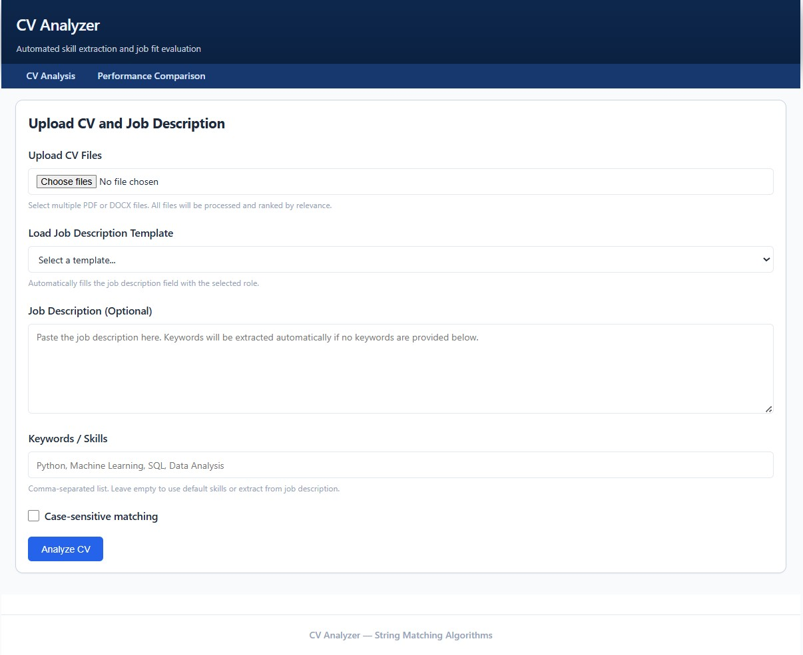
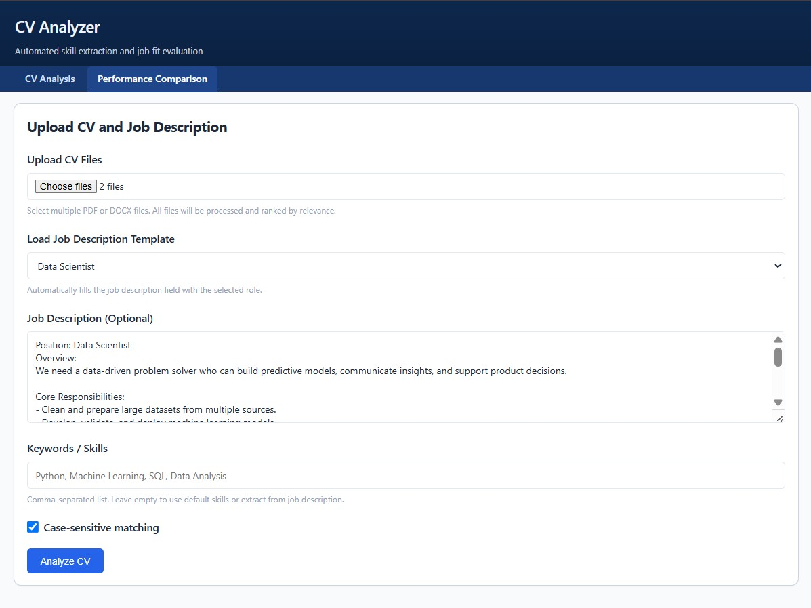
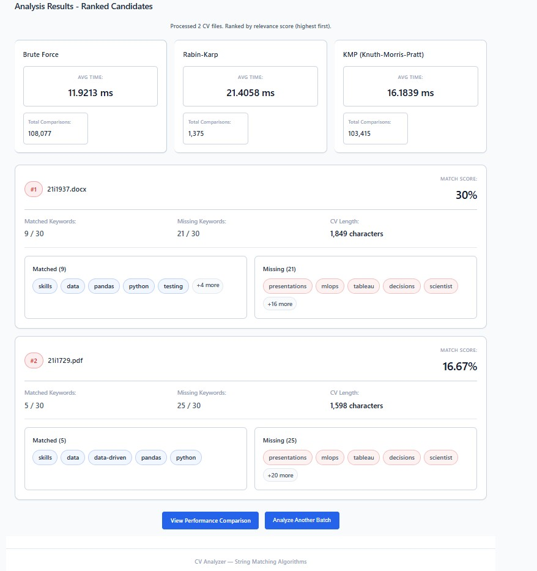
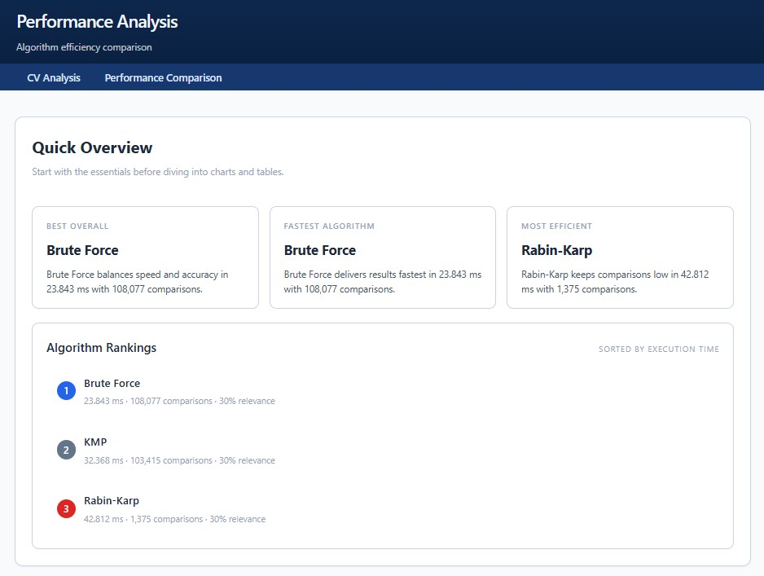
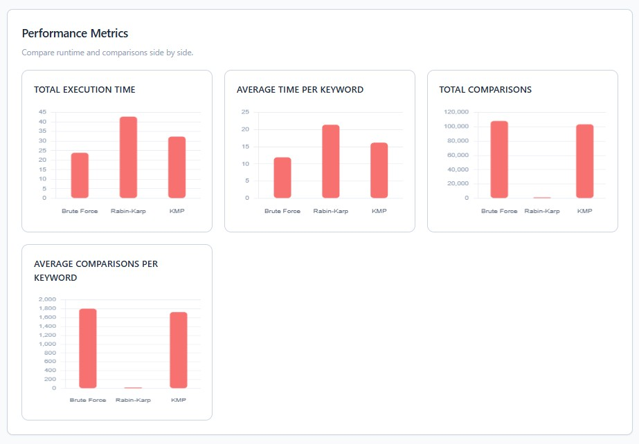
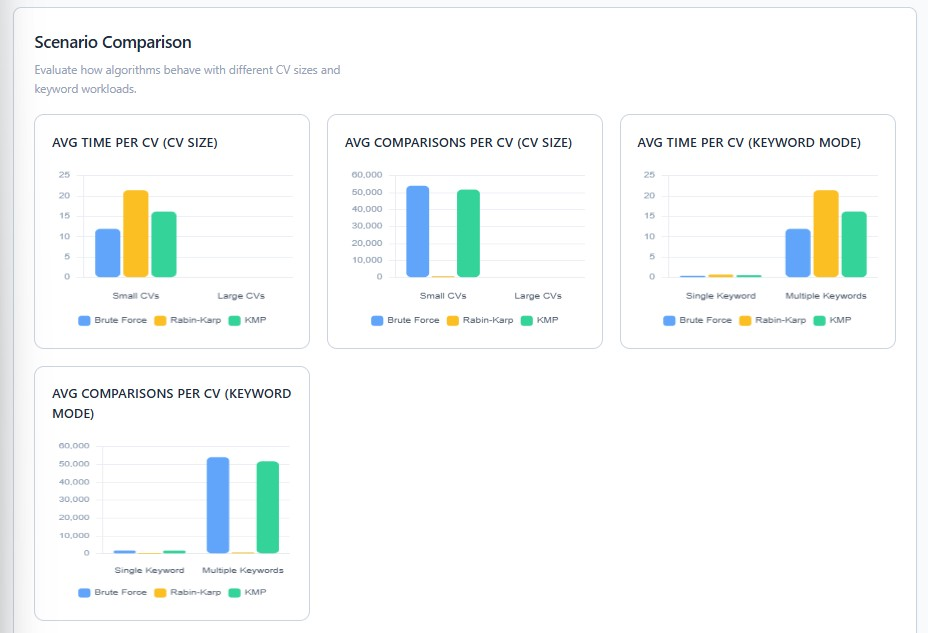
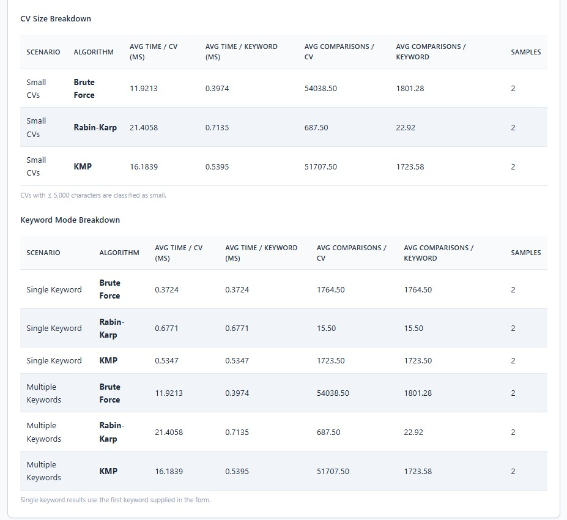
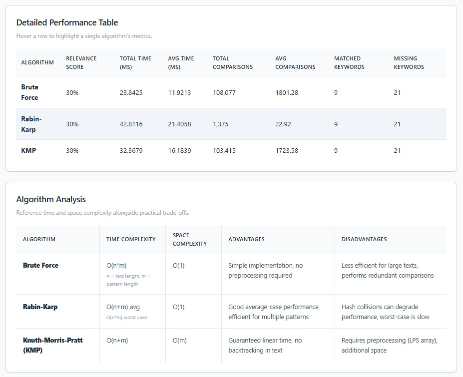
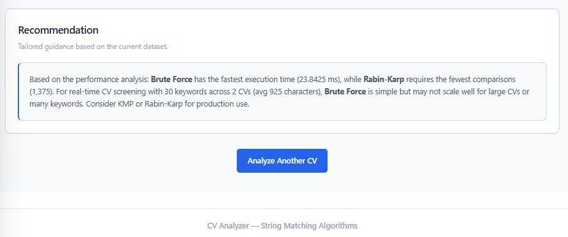

# CV Analyzer - Flask Web Application
Intelligent CV Analyzer using String Matching Algorithms (Brute Force, Rabin-Karp, KMP) for Automated Skill Extraction and Job Fit Evaluation.
## Features
- **Three String Matching Algorithms:**
  - Brute Force Algorithm
  - Rabin-Karp Algorithm  
  - Knuth-Morris-Pratt (KMP) Algorithm

- **CV Analysis:**
  - Upload PDF, DOCX, or TXT files
  - Automatic keyword extraction from job descriptions
  - Skill matching and relevance scoring
  - Case-sensitive/insensitive matching

- **Performance Analysis:**
  - Execution time comparison
  - Character comparison counts
  - Performance charts and tables
  - Algorithm recommendations
## Setup Instructions
### 1. Install Dependencies

```bash
pip install -r requirements.txt
```

Or using the specific Python interpreter:
```bash
"C:\Users\Muhammad Noor\AppData\Local\Programs\Python\Python313\python.exe" -m pip install -r requirements.txt
```
### 2. Run the Application

```bash
python app.py
```

### 3. Access the Application
Open your browser and go to:
```
http://localhost:5000
```

---

## Project files (as shipped)

The repository already contains the following files and folders:

- install.bat
- requirements.txt
- run.bat
- i232520_MuhammadNoor_A2.pdf           — assignment / report
- README.md                              — this file
- job_desc_data_scientist.txt            — sample job description
- job_desc_software_tester.txt
- job_desc_web_developer.txt
- app.py                                 — Flask application and main entry point
- templates/
  - index.html                           — upload / analyze UI
  - results.html                         — performance / results UI
- static/
  - styles.css
- screenshots/
  - ss-1.jpg        
- DataSet/
  - abc.docx                             — sample CV / dataset file

---

## Usage
1. **Analyze a CV:**
   - Go to the home page (http://localhost:5000)
   - Upload a CV file (PDF, DOCX, or TXT)
   - Optionally paste a job description or provide keywords
   - Click "Analyze CV"
   - View results for all three algorithms

2. **Performance Comparison:**
   - After analyzing a CV, click "View Performance Comparison"
   - See detailed performance metrics
   - View charts and algorithm recommendations

## Technologies Used
- **Backend:** Flask 3.0.0
- **Frontend:** HTML5, CSS3, JavaScript
- **Libraries:** PyPDF2, python-docx
- **Charts:** Chart.js

--- 
## Flowchart 
- **Upload CV -> Extract Text -> Clean & Preprocess -> Extract Keywords from JD -> Match with (Brute / Rabin-Karp / KMP) -> Measure (time & comparisons) -> Score & Rank -> Visualize results & recommendations**

---

---
##  String Matching Visualizations

Simple vertical list (works everywhere):


*Figure 1 — Main Application Interface*


*Figure 2 — Uploading CV And Job Description*


*Figure 3 — Analysis Results- Ranked Candidates*


*Figure 4 — Algorithm Rankings*


*Figure 5 — Performance Metrics*


*Figure 6 — Scenario Comparison*


*Figure 7 — CV Size And Keyword Mode Breakdown*


*Figure 8 — Detailed Performance Table And Algorithm Analysis*


*Figure 9 — Recommendation Insights*

## Algorithms Implemented
### 1. Brute Force
- **Time Complexity:** O(n*m)
- **Space Complexity:** O(1)
- Simple but less efficient for large texts

### 2. Rabin-Karp
- **Time Complexity:** O(n+m) average, O(n*m) worst case
- **Space Complexity:** O(1)
- Good average-case performance with hash-based matching

### 3. Knuth-Morris-Pratt (KMP)
- **Time Complexity:** O(n+m)
- **Space Complexity:** O(m)
- Guaranteed linear time with optimal performance

Each implementation measures:

Execution time (ms)
Character comparison counts
Matches found (positions or counts)
Those metrics are used for the results page and charts.


## Troubleshooting
### ModuleNotFoundError
If you get import errors, ensure you're using the correct Python interpreter:

```bash
# Checking Python version
python --version

# Installing packages for that Python
python -m pip install -r requirements.txt
```

Or use Python 3.13 directly:
```bash
"C:\Users\Muhammad Noor\AppData\Local\Programs\Python\Python313\python.exe" -m pip install -r requirements.txt
"C:\Users\Muhammad Noor\AppData\Local\Programs\Python\Python313\python.exe" app.py
```

